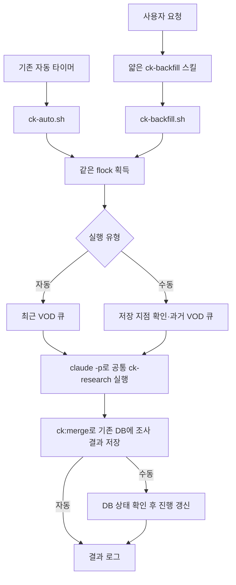

# CK 수동 백필 최종 계획

작성: 2026-09-27, 갱신: 2026-09-28. 아래 구조를 구현했다. 운영 명령은 [CK-BACKFILL.md](CK-BACKFILL.md)를 따른다.

검증: 단위·셸 잠금/중단 테스트, 임시 DB 및 HTTP fixture의 CLI 큐 생성·저장 후 재개·소진을 확인했다.
실제 DB에는 0044를 적용하고 대상 상태 조회를 확인했다. 실제 VOD 프레임 판독을 동반하는 백필 실행은 아직 수행하지 않았다.

## 1. 목적과 확정 정책

사용자가 요청할 때만 지정 스트리머의 과거 VOD를 **최근순으로** 조사한다.
다음 요청에서는 중단된 VOD와 저장한 진행 지점부터 이어간다.
화면 탐색·경기 추적·중복 연결·근거 저장은 기존 `ck-research`를 그대로 사용한다.

- 백필용 타이머·서비스·자동 반복·자동 조사 후 남는 시간의 백필을 추가하지 않는다.
- 한 요청은 한 스트리머를 대상으로 한다. 다른 스트리머를 요청해도 기존 진행은 보존한다.
- 판독 규칙을 새 스킬에 복사하지 않는다. 새 스킬은 실행·재개·보고만 담당한다.
- 경기·근거·VOD 조사 상태는 자동·수동이 공유한다. 수동 백필 대상은 자동 큐에서 제외한다.
- 실제 조회 가능한 본방을 조사한다. 삭제·비공개까지 복원하거나 역사 전체를 확보했다고 표현하지 않는다.

## 2. 구조와 실행 방식



수동 실행도 기존 자동 실행과 같은 셸 래퍼 방식이다.
**잠금 → 진행 복구·큐 생성 → `claude -p` → DB 확인·진행 갱신 → 보고**를 한 실행에서 처리한다.
잠금은 목록 조회 전부터 자식 조사 프로세스 종료와 진행 갱신까지 유지한다.
사용자는 대화로 실행을 요청하고, 진행은 로그·실행 상태로 확인한다.
새 스킬이 자식에게 자기 자신을 다시 실행시키지 않도록 자식 프롬프트는 `ck-research`와 큐를 지정한다.

대화 중 잠금을 별도 관리 프로세스로 유지하거나, 개별 조사 명령마다 잠금 생존 여부를 확인하는
장치는 만들지 않는다. 사용자 중단 시 셸이 조사 자식도 종료·회수하고 잠금을 해제한다.
비정상 종료로 진행을 갱신하지 못하면 다음 요청에서 DB를 대조해 복구한다.

| 구성 | 책임 |
|---|---|
| 기존 `ck-research` | 화면 판독·경기 추적·중복 판단·근거 저장 |
| 새 `ck-backfill` 스킬 | 요청 해석, 수동 실행 셸 호출, 로그 확인·종료 보고 |
| 백필 실행 셸 | 공통 잠금, 큐 생성, `claude -p` 실행, 종료 후 DB 확인 |
| 백필 도구 | 채널 해석·최근순 선택·재개·진행 갱신 |
| 기존 `event_lead`와 저장 도구 | VOD 조사 상태·근거의 정본 |

## 3. 시작 상한과 실행 분량

### 시작 상한

첫 요청에서 상한을 고정하고 이후에는 앞으로 되돌리지 않는다.

- **와치리스트 스트리머:** 자동 큐의 최근 3일 범위보다 과거부터 시작한다.
- **와치리스트 밖 스트리머:** 최초 요청 시각을 상한으로 시작한다. watch를 자동 등록하지 않는다.

현재 자동 큐는 최근 72시간이 아니라 **KST 오늘 포함 3개 날짜**를 사용한다
(`FROM = kstDate(DAYS - 1)`). 따라서 "3일 전부터"의 정확한 계약은
**최초 자동 조회 하한 미만**이다. 예를 들어 2026-09-28에 시작하면 자동 범위는
9월 26~28일, 백필은 9월 26일 00:00 KST 미만(날짜 필터의 끝은 9월 25일)이다.
VOD의 등록/종료 시각으로 경계를 나누며 방송 시작일로 바꾸지 않는다.
자동 큐와 같은 날짜 계산을 재사용하고, 범위 기본값이 바뀌면 신규 백필도 같은 기준을 따른다.
기존 백필의 고정 상한은 유지한다.

이름이 여러 사람과 일치하면 대상을 확인한다. 기존 진행을 재개할 때 현재 watch 여부나
새 VOD 업로드 때문에 최초 상한을 바꾸지 않는다.

### 분량

기본은 **최대 5개·선택 영상 길이 합계 20시간**이며 먼저 도달하는 제한을 따른다.
사용자가 분량을 지정하면 그 제한을 적용한다. 이미 완료해 건너뛴 VOD는 포함하지 않고,
재개 VOD는 1개로 계산한다. 재개 VOD도 보수적으로 전체 영상 길이를 시간 합계에 포함한다.

- 다음 VOD를 넣으면 합계가 초과되는 경우 그 VOD부터 다음 요청에 남긴다.
- 첫 VOD 하나가 20시간을 넘으면 그 하나만 예외로 선택한다. 영원히 선택되지 않는 것을 막는다.
- 길이를 모르면 0시간으로 세지 않는다. 상세 조회로 확인하고, 그래도 모르면 단독 선택해 한계를 보고한다.
- 영상 길이는 분석 비용의 근사값이며 실제 실행 시간 제한은 아니다. 시간·세션 한도나 사용자 중단 시
  남은 범위를 `running`으로 저장하고 다음 요청에서 이어간다.

## 4. 최소 저장 모델

**VOD별 조사 상태가 정본이고 커서는 목록 재조회를 줄이는 보조 정보다.**
새로운 VOD별 작업 참조 표나 자동↔수동 소유권 이관 체계는 만들지 않는다.

| 저장 위치 | 내용 |
|---|---|
| 채널별 백필 진행 한 행 | 스트리머·채널, 고정 상한, 마지막 처리 경계의 시각·VOD 번호, 목록 소진 여부·확인 시각 |
| `event_lead.raw.backfill` | 수동 백필 표시와 해당 채널별 진행 식별자 |
| 기존 `raw.scan`·조사 기록 | 완료·중단·실패 범위·실제 읽은 범위·근거·남은 질문 |
| 작은 접근 상태 부가 필드 | 일시 실패/확인된 접근 불가 구분, 사유·확인 시각. 조사 상태를 복제하지 않음 |

`scan.failed`는 `TimeRange[]`이므로 사유 문자열을 넣지 않는다. VOD 전체를 열지 못해
길이조차 모르는 경우 임의 시간 범위나 열람 기록을 만들어 넣지 않는다.

### VOD 식별과 백필 표시

큐로 선택한 VOD에 백필 표시를 먼저 저장한다. 아직 lead가 없으면 기존 upsert 경로를 재사용해 만든다.
식별자는 `ck:merge`와 정확히 같은 **`source = 'vod_title'`, `source_key = 'vod:<번호>'`**를 쓴다.
필수 제목·채널·URL·관찰 시각도 기존 계약을 따른다. 백필 전용 source를 만들지 않는다.

기존 raw를 보존하고 `backfill` 키만 병합한다. 현재 lead upsert는 JSONB 병합을 사용하지만,
기존 scan과 다른 raw 키가 보존되고 후속 `ck:merge`에서도 백필 표시가 남는지 회귀 검증한다.
백필 표시만 있고 scan이 없는 상태는 미조사다. 큐 등록을 `running`·읽음·완료로 위장하지 않는다.

### 진행 갱신과 중단 복구

1. 선택 대상의 정규화된 lead와 백필 표시를 저장한다. **큐 생성만으로 커서를 옮기지 않는다.**
2. `claude -p`가 기존 스킬로 조사하고 VOD마다 `ck:merge`로 저장한다.
3. 종료 후 도구가 DB의 상태·범위·접근 불가 사유를 확인한다. 프로세스 종료 코드나 모델의 완료 선언만 믿지 않는다.
4. 최근순으로 연속 처리된 경계까지만 갱신한다. 미조사·중단·일시 실패 VOD를 뛰어넘지 않는다.
5. 다음 요청은 백필 표시와 기존 조사 기록을 대조해 이전 중단 지점부터 재개한다.

경기 저장 후 커서 갱신 전에 죽어도 다음 실행에서 복구한다. 진행 갱신은 트랜잭션으로 처리하고
같은 결과를 다시 확인해도 중복 lead·경기·진행이 생기지 않게 한다.
처음 선택한 5개 중 세 번째에서 중단하면 네 번째·다섯 번째는 표시만 있는 미조사로 남는다.

기존 `done`은 정보가 모두 채워졌다는 뜻이 아니다. 미해결 후보만을 이유로 VOD 전체를 다시 보지 않는다.
다만 부분 범위만 본 `done`을 전체 완료로 재사용하지 않는다. 요청 범위와 실패 범위를 확인한다.

### 실패 처리

- 일시적 API/HLS 실패: 재시도할 지점에 남기고 이번 실행을 종료한다. 다음 요청에서 다시 시도한다.
- 확인된 삭제·비공개 등 접근 불가: 사유를 기록하고 처리 경계는 지나갈 수 있다. 조사 성공과 별도로 집계한다.
- 한 번의 네트워크 실패·빈 응답은 영구 접근 불가나 목록 소진의 근거가 아니다.
- 별도의 보류 큐는 만들지 않는다. 영구 접근 불가 재확인은 명시적 사용자 요청으로 수행한다.

## 5. 목록 선택과 자동 큐 경계

기존 `listBroadcasts`의 본방 API와 HTTP 게이트웨이를 사용한다. 제목·카테고리로 제외하지 않는다.

- 최신순 정렬과 처리 경계는 종료/등록 시각 + VOD 번호 조합으로 정한다. 페이지 번호만 저장하지 않는다.
- 날짜 필터의 경계 날짜를 포함해 재조회하고 정렬 키·VOD ID·기존 기록으로 중복을 제거한다.
- 필요한 작업 수만큼 날짜 범위를 나눠 조회한다. 매번 채널의 전체 과거 목록을 가져오지 않는다.
- 같은 날짜의 모든 페이지를 고려하기 전에 그 날짜보다 과거로 경계를 옮기지 않는다.
- 오류·페이지 상한·`truncated`이면 조회가 확인된 경계 밖으로 진행하지 않는다.
  확보한 대상은 조사할 수 있지만 전체 소진으로 표시하지 않는다.
- 빈 날짜 구간이면 더 과거를 확인한다. 정상 응답과 확인 범위를 근거로만 목록 소진을 기록한다.
- 뒤늦게 공개된 과거 VOD를 찾기 위한 전체 재대조는 별도 요청으로 수행한다.

### 자동 큐의 제외 계약

`raw.backfill`이 있는 VOD는 **최근 대상, 기간 밖 running, lead_only 모두**에서 제외한다.
최근 범위 안의 `running`·`failed_left`도 이 제외 조건을 우회하지 못한다.

코드상 `lead_only`는 최근 목록 루프 안의 분기다. 최근 루프에서는 상태 분류 전에 백필 표시를
검사하고, 기간 밖 running 조회에도 같은 제외 조건을 적용한다. 구현 위치가 두 곳이어도
검증은 세 경우(최근, 기간 밖 running, 표시만 있는 lead_only)를 각각 확인한다.
조회와 중복 제거 역시 `(source, source_key)` 계약을 따른다.

백필 완료 결과는 자동 경로도 재사용하며, 자동 완료 결과는 백필도 재사용한다.
백필 표시가 있는 VOD는 잠금 해제·프로세스 종료 후에도 다음 사용자 요청으로만 재개한다.
와치리스트 밖에서 백필을 시작한 뒤 watch에 추가되어도 이 표시를 존중한다.

### 자동 미완료 VOD를 만났을 때

상한 밖에도 오래된 자동 `running`이 남아 있을 수 있다. 백필 표시가 없고 자동 큐가 재개할
와치리스트 채널의 `running`이면 백필로 넘겨받지 않는다. **그 VOD에 표시를 붙이지 않고,
그 지점에서 이번 백필을 종료한다. 커서는 그 VOD를 넘어가지 않는다.** 다음 요청에서 완료 여부를 확인한다.

단순히 기존 lead가 있거나 `lead_only`라는 이유만으로 자동 실행 몫으로 취급하지 않는다.
과거 단서만 있는 VOD는 기존 lead를 보존하고 백필 표시를 붙여 조사할 수 있다.
자동이 맡은 중단 작업을 수동으로 이관하는 기능은 1차에서 제외한다.

## 6. 잠금과 실행 환경

- 수동 셸은 기존 `ck-auto.sh`와 **동일한 잠금 파일에 `flock`**을 획득한다.
- 파일의 존재 여부를 실행 여부로 해석하지 않는다. 셸이 자식 조사가 끝날 때까지 잠금을 보유한다.
- 잠금이 사용 중이면 자동은 기존처럼 건너뛰고 수동은 사용 중임을 알린 뒤 시작하지 않는다.
  요청을 미래에 자동 실행할 대기 작업으로 남기지 않는다.
- 별도 관리 프로세스·개별 명령의 잠금 생존 검사·소유권 이관 시스템을 만들지 않는다.
- SOOP 조사 도구를 병렬 실행하지 않고 기존 HTTP 게이트웨이를 사용한다. 요청 간격은 프로그램별이므로
  이 구조가 전역 HTTP 속도 제한까지 보장한다고 표현하지 않는다. 별도 전역 제한 구현은 이번 범위에서 제외한다.

1차에서는 **VOD 조사 실행 컴퓨터를 한 대로 지정**한다. 다른 컴퓨터의 웹 서버 실행은 무관하다.
조사 컴퓨터를 바꿀 때 이전 조사와 자동 타이머를 중지한다. 같은 DB에서 진행은 복원할 수 있지만
`out/`의 근거 파일·환경변수는 별도 이전이 필요하다. 다중 컴퓨터 동시 조사는 이번 범위에 넣지 않는다.

## 7. 구현 범위와 사용 형태

아래 파일·명령을 구현했다. 큐 생성·체크포인트·접근 상태 변경은 셸이 보유한 공통 잠금 아래에서 수행한다.

| 변경 대상 | 내용 |
|---|---|
| `.claude/skills/ck-backfill/SKILL.md` 신규 | 수동 요청 진입, 셸 실행·로그 확인·보고. 분석 규칙 복사 없음 |
| `.claude/skills/ck-research/SKILL.md` | 공통 분석 진입 안내만 보완. 화면 판독 방식 유지 |
| `scripts/ck-backfill.sh` 신규 | 동일 flock → 큐 → claude -p → DB 확인·진행 갱신 |
| `scripts/ck-backfill.ts` 신규·npm 명령 | 상태 조회, 상한 계산, 최근순 선택, lead 표시, 진행 대조·갱신 |
| DB migration·core DB 함수 | 채널별 진행 한 행, raw.backfill·접근 사유 병합, 멱등 갱신 |
| `scripts/ck-queue.ts` | 최근/기간 밖 running/lead_only의 백필 제외 |
| `scripts/ck-merge.mjs` | probe가 측정한 전체 길이를 raw.vod_total_sec에 보존해 부분 done과 전체 완료를 구분 |
| 목록 조회 보조 기능 | 날짜 경계·잘림·길이 제한 처리, 기존 자동 큐 정책 보존 |
| 문서·검증 | 실행·로그·재개 안내와 회귀 테스트 |

```bash
# 읽기 전용 상태 확인
npm run ck:backfill -- status --streamer 이상호

# 사용자 요청으로만 시작하는 수동 실행 (제안 인터페이스)
scripts/ck-backfill.sh --streamer 이상호 --limit 5 --max-video-hours 20
```

셸이 큐 선택·진행 갱신용 내부 명령을 호출한다. 상태 조회를 제외한 변경 명령은 공통 잠금 아래에서 실행한다.
기존 `ck:merge`는 조사 저장 창구로 유지하고, 진행 도구가 그 DB 결과를 확인한다.
새 판독기·별도 VOD 작업 표·소유권 이관·새 타이머·검수 UI·분산 실행은 만들지 않는다.

## 8. 구현 순서와 검증

1. 채널별 진행과 기존 lead의 백필 표시·접근 사유 저장 계약을 구현한다.
2. 자동 범위와 맞춘 고정 상한, 최근순 선택·재개·개수/길이 제한을 구현한다.
3. 자동 큐의 백필 제외와 수동 셸의 공통 flock·자식 실행을 연결한다.
4. DB 대조·연속 처리 경계 갱신·중단 복구를 검증한다.
5. 검증된 명령으로 얇은 스킬과 실행 안내를 작성한다.

| 검증 사례 | 기대 결과 |
|---|---|
| KST 날짜 경계에서 watch 대상 시작 | 자동 3개 날짜와 백필 상한이 겹치지 않음 |
| watch 밖 대상·나중에 watch 추가 | 최초 상한 유지, 수동 표시 존중 |
| 같은 날짜·시각의 여러 VOD, 새 VOD 추가 | 누락·중복 없이 고정 상한에서 최근순 진행 |
| 같은 VOD에 선등록 후 ck:merge | vod_title + vod:<번호> 행 하나, raw.backfill과 기존 raw 보존 |
| 표시만 있는 lead_only | 자동 큐에서 제외, 열람·완료로 처리되지 않음 |
| 수동 표시 + 최근 running/failed_left·기간 밖 running | 자동 큐의 모든 선택 경로에서 제외 |
| 오래된 자동 running을 만남 | 이관·표시·커서 통과 없이 해당 지점에서 종료 |
| 기존 자동 완료·부분 범위 done | 전자는 재사용, 후자는 남은 범위를 조사 |
| 큐만 만든 뒤 중단 | 처리 경계가 이동하지 않음 |
| 중간 VOD 중단·경기 저장 후 커서 갱신 전 종료 | 다음 요청에서 DB 대조로 안전하게 재개 |
| 같은 결과 재확인 | lead·경기·진행 중복 없음 |
| 일시 실패·영구 접근 불가 | 사유를 범위 배열과 분리, 성공으로 위장하지 않음 |
| API 실패·truncated·빈 날짜 구간 | 전체 소진으로 오인하지 않음 |
| 5개/20시간 경계·20시간 초과 단일 VOD·길이 미상 | 제한 준수, 단일 예외 선택·한계 보고 |
| 자동·수동 동시 시작, 사용자 중단 | 하나만 실행, 자식 종료 후 잠금 해제 |
| 다른 스트리머 요청 후 복귀 | 각 채널의 진행 보존 |

단위 테스트는 목록 경계·상태 대조·분량 제한을, 폐기 가능한 DB 검증은 lead 식별·raw 보존·진행 갱신을 확인한다.
`npm test`, `npm run typecheck`, `npm run verify:db`, `npm run verify:modules`를 수행한다.
실제 소량 VOD로 첫 실행 → 중단 → 재개 → 기존 경기 재사용을 확인하고 검증한 범위만 보고한다.

## 9. 완료 기준

사용자 요청으로 과거 VOD를 최근순 조사하고 다음 요청에서 중단 지점부터 이어갈 수 있어야 한다.
자동 타이머는 표시된 수동 백필을 가져가지 않는다. 진행은 DB에 저장된 결과로만 갱신한다.
종료 보고에는 선택·실제 조사·기존 완료 재사용·접근 불가·미완료를 구분하고 다음 시작 지점을 남긴다.

관련 문서: [공통 CK 조사 설계](CK-RESEARCH-PLAN.md),
[공통 조사 스킬](../.claude/skills/ck-research/SKILL.md).
